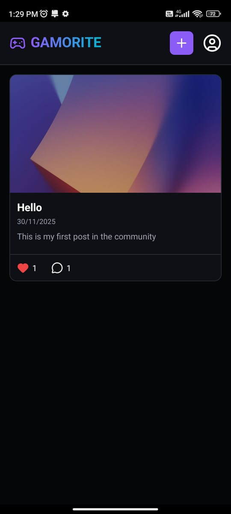
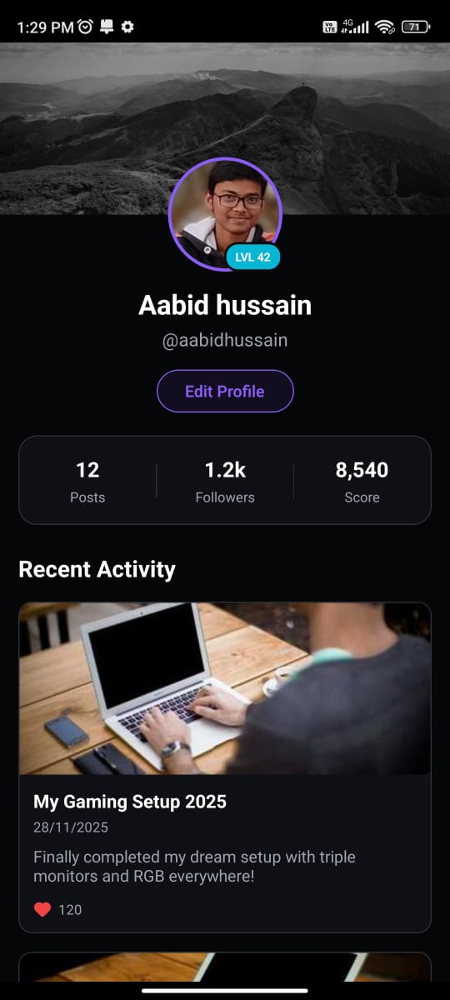
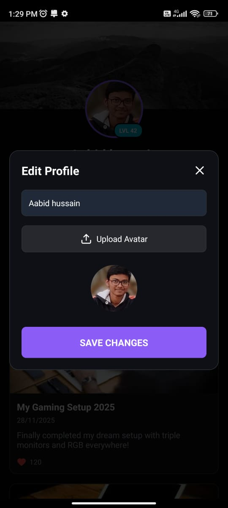

# Gamorite 

Gamorite is a social gaming community application built with React Native and TypeScript. It provides a platform for gamers to share their gaming moments, connect with others, and build their gamer profile in a sleek, dark-themed environment.

##  Features

*   **Community Feed**: Browse through a feed of gaming posts with images, titles, and descriptions.
*   **Interactive Posts**: Like posts and engage in discussions via the comment section.
*   **Create Posts**: Share your own highlights by uploading images from your gallery and adding descriptions.
*   **User Profiles**:
    *   Create a unique identity with a Username and Avatar.
    *   View stats like Level, XP, and Followers.
    *   Edit your profile details easily.
*   **Dark/Neon Aesthetic**: A UI designed specifically for the gaming audience with gradients and modern typography.
*   **Local Persistence**: All data (posts, user session) is persisted locally using AsyncStorage, making it a great standalone demo.

## 📸 Screenshots

  
  
  

##  Tech Stack

*   **Framework**: React Native (0.82.1)
*   **Language**: TypeScript
*   **State Management**: React Context API
*   **Storage**: @react-native-async-storage/async-storage
*   **Icons**: lucide-react-native
*   **Graphics**: 
eact-native-svg
*   **Media**: 
eact-native-image-picker

##  Getting Started

### Prerequisites

*   Node.js
*   React Native Development Environment (Android Studio or Xcode)

### Installation

1.  **Clone the repository**
    `ash
    git clone <repository-url>
    cd Assignment
    `

2.  **Install dependencies**
    `ash
    npm install
    # or
    yarn install
    `

3.  **Install iOS Pods (iOS only)**
    `ash
    cd ios
    pod install
    cd ..
    `

### Running the App

*   **Android**:
    `ash
    npx react-native run-android
    `a

*   **iOS**:
    `ash
    npx react-native run-ios
    `

##  Project Structure

`
src/
 assets/             # Static assets
 common-styles/      # Shared colors, types, and interfaces
 components/         # Reusable components (e.g., UserProfileModal)
 context/            # Global state (AuthContext)
 screens/            # Application screens
    CommunityFeedScreen.tsx  # Main feed & post creation
    ProfileScreen.tsx        # User profile & stats
 utils/              # Helper functions
`

##  Notes

*   This application currently uses **local storage** (AsyncStorage) to simulate a backend. Clearing the app data will reset the feed and user profile.
*   Image uploading uses the device's native image picker.

---
*Built for the gaming community.*
